# CandyCrushSaga
Languages used: Java ,J-frame.
Similar to the well-known mobile game with different levels and difficulties. Moreover, it has an additional feature where the users can customize
games by choosing levels and difficulties   . 
College project for object oriented programming (OOP) course. (2021).   

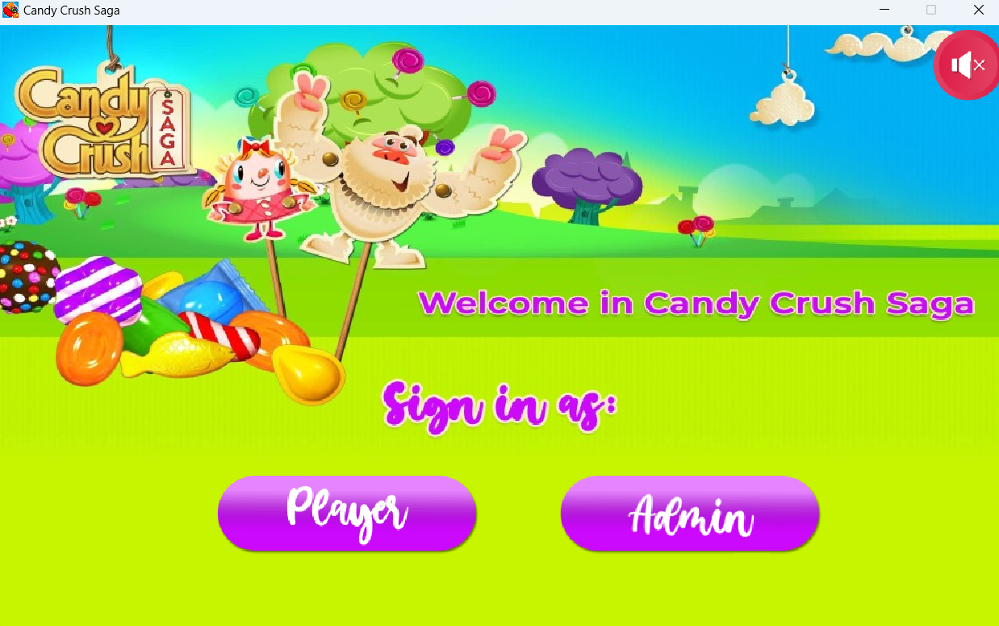

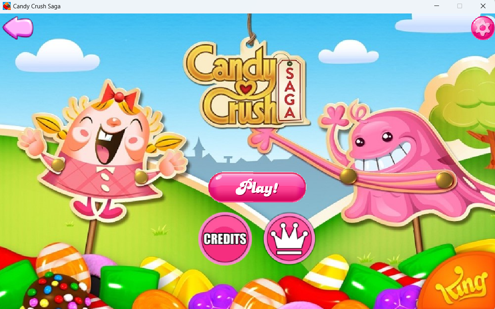

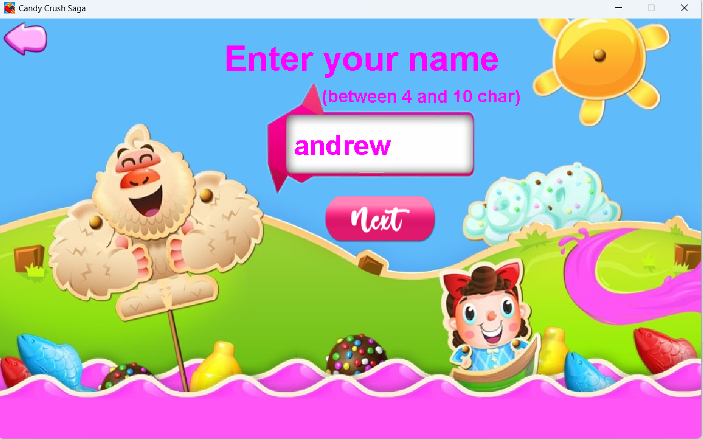

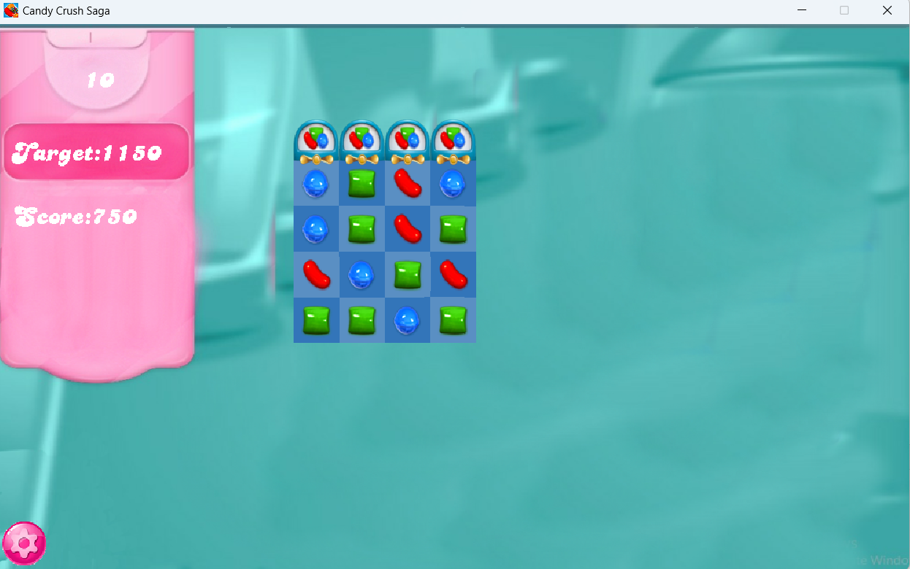

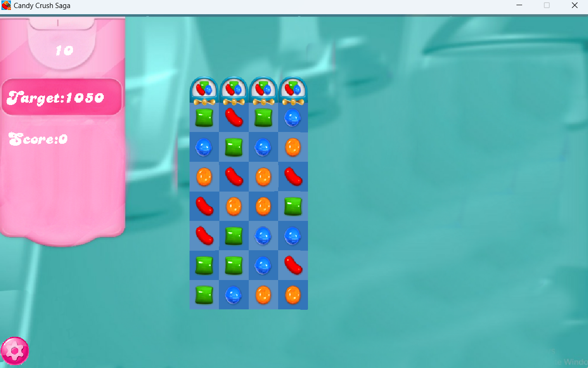

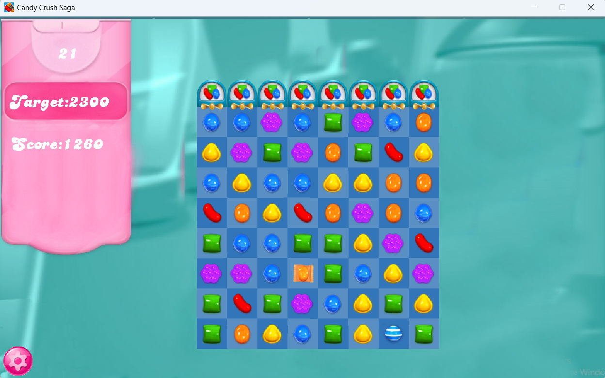

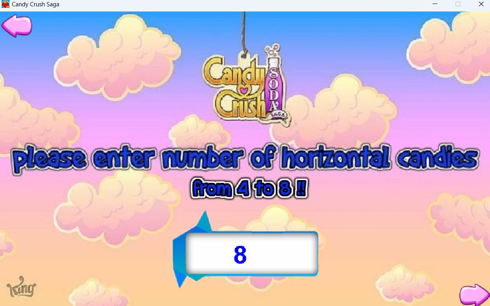

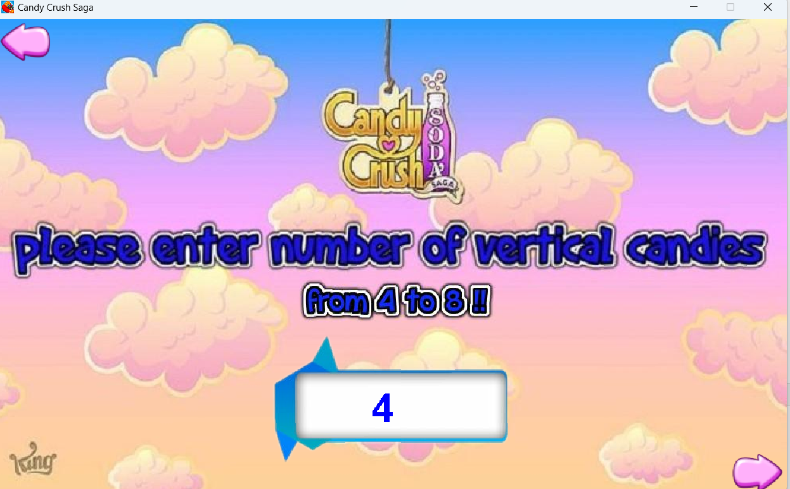

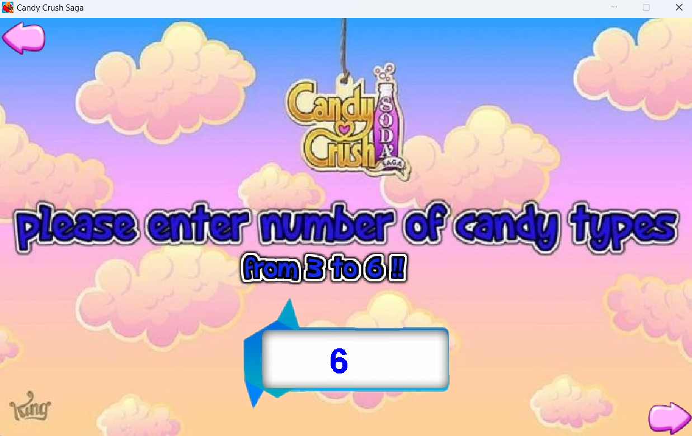

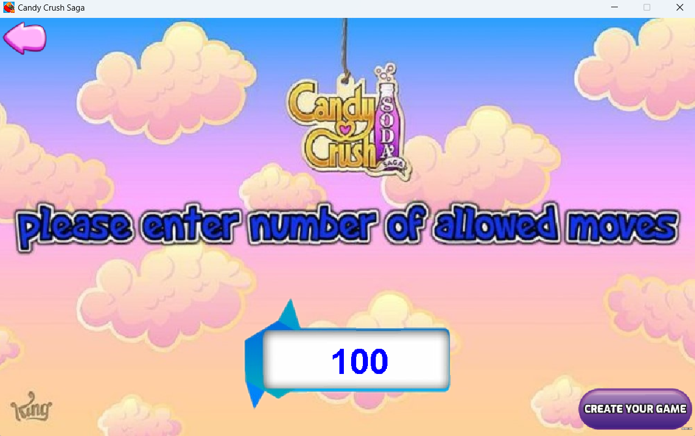

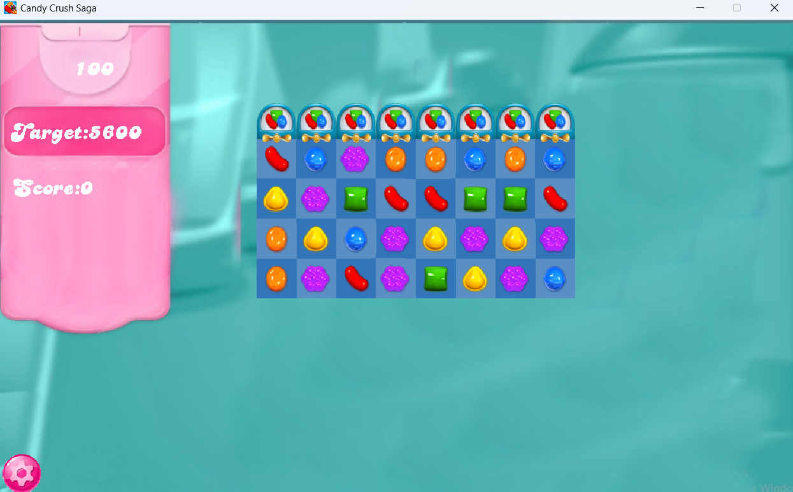
